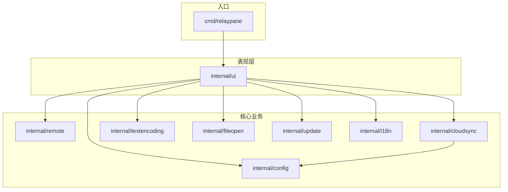

# RelayPane 技术需求文档（TRD）

> **版本**：1.0.2（与 `internal/version/version.go` 一致）  
> **范围**：功能与实现约束；**不含**界面布局、视觉、交互样式等 UI 规格。  
> **依据**：当前主分支源码（`cmd/relaypane` + `internal/*`）。

---

## 1. 项目概述

### 1.1 产品定位

RelayPane 是一款基于 Go 的 **Windows 桌面 SFTP 双栏文件管理器**，核心能力包括：

- 本地与远程文件系统对照浏览
- 双向文件传输（上传/下载、目录递归）
- 远程文本在线编辑（编码感知）
- 多 SSH 会话并行（多标签）
- 可配置 SSH 心跳保活与断线感知
- 远程运维辅助（系统信息、网络、磁盘、du、资源、Shell）
- 服务器列表 AES 加密云端备份/恢复
- 应用内 GitHub 版本检查

### 1.2 命名与部署形态

- 发布产物为 **单个可执行文件** `RelayPane.exe`，免安装、无额外运行时依赖（Go/Python/VC++ 等）。
- 配置与密钥材料保存在用户目录 `%USERPROFILE%\.relaypane\`。
- 协议支持：**SSH + SFTP**（不支持 FTP、SCP 独立模式、WebDAV、S3 等）。

### 1.3 不在范围内

- 脚本自动化、命令行批处理接口
- PuTTY / Pageant 集成
- 多协议文件传输
- 服务端安装与运维（RelayPane 为客户端）

---

## 2. 技术架构

### 2.1 技术栈

| 层级 | 技术 | 说明 |
|------|------|------|
| 语言 | Go 1.22+ | 模块路径 `github.com/relaypane/relaypane` |
| GUI（主实现） | Fyne v2 | `internal/ui/` |
| GUI（备选） | walk (Win32) | `internal/walkui/`，与 Fyne 版功能对齐的实验/备选前端 |
| SSH | `golang.org/x/crypto/ssh` | 连接、Shell 会话 |
| SFTP | `github.com/pkg/sftp` | 文件读写、目录列表 |
| 文本编码 | `golang.org/x/text` | GB18030 等 |
| 云同步加密 | AES-GCM + scrypt | `internal/cloudsync/crypto.go` |

### 2.2 模块划分

```
cmd/relaypane/          程序入口（Fyne）
cmd/relaypane-walk/     程序入口（walk 备选）
internal/config/        服务器列表与应用设置持久化
internal/remote/        SSH/SFTP 客户端、心跳、Shell 执行
internal/cloudsync/     云端 API、加解密、载荷打包
internal/fileopen/      系统默认程序打开文件、二进制/文本判定
internal/textencoding/  编辑器编码检测与转码
internal/update/        GitHub Releases 版本比对
internal/i18n/        中英文文案
internal/ui/            Fyne 业务与表现层
internal/walkui/        walk 业务与表现层
internal/version/       版本号常量
```

### 2.3 设计原则

- **业务逻辑与传输层分离**：`remote.Client` 封装 SSH/SFTP，UI 层通过队列与 goroutine 调用，避免阻塞主线程。
- **会话隔离**：每个标签页独立 `remote.Client`、独立心跳、独立远程路径状态。
- **大操作异步化**：远程目录列表、删除、传输、Shell 命令均在后台 goroutine 执行。
- **窗口尺寸不变量**（稳定性约束）：窗口尺寸仅允许用户拖拽边缘或双击标题栏改变；菜单、列表刷新、overlay 等路径不得调用 `window.Resize()` 进行尺寸修正。

---

## 3. 运行环境与部署

### 3.1 目标平台

- **操作系统**：Windows 10 / 11（64 位）
- **网络**：需能 TCP 连接远程 SSH 端口（默认 22）
- **远程端**：Linux/Unix 类系统（运维功能依赖 `proc`、`df`、`du`、`ss`/`netstat`、`ps` 等命令）

### 3.2 编译与发布

- 开发运行：`go run ./cmd/relaypane`
- 发布构建：`go build -ldflags="-H=windowsgui -s -w" -o RelayPane.exe ./cmd/relaypane`
- `release.bat [版本号]` 生成带图标与版本资源的发布包至 `release\`

### 3.3 开发者依赖

- Go 1.22+
- C 编译器（Fyne 原生依赖）：TDM-GCC 或 MinGW-w64

---

## 4. 数据模型与持久化

### 4.1 存储路径

| 文件 | 路径 | 权限 |
|------|------|------|
| 服务器列表 | `%USERPROFILE%\.relaypane\servers.json` | `0600` |
| 应用设置 | `%USERPROFILE%\.relaypane\settings.json` | `0600` |
| 云同步导入私钥 | `%USERPROFILE%\.relaypane\keys\{server-id}.pem` | `0600` |
| 云同步错误日志 | `%USERPROFILE%\.relaypane\cloudsync.log` | 追加写入 |

### 4.2 服务器配置（`config.Server`）

```json
{
  "id": "srv-1710000000000000000",
  "name": "生产机",
  "host": "192.168.1.10",
  "port": 22,
  "username": "deploy",
  "password": "可选，明文存储于本地 JSON",
  "auto_ssh_key": true,
  "private_key_path": "可选，指定私钥文件路径",
  "remote_root": "/",
  "local_root": "C:\\Users\\me\\Projects",
  "heartbeat_sec": 30
}
```

| 字段 | 类型 | 默认值 | 说明 |
|------|------|--------|------|
| `id` | string | 新建时 `srv-{unixnano}` | 唯一标识；临时连接为 `tmp-{unixnano}` 不持久化 local_root |
| `name` | string | — | 显示别名 |
| `host` | string | 必填 | 主机名或 IP |
| `port` | int | 22 | SSH 端口 |
| `username` | string | 必填 | SSH 用户名 |
| `password` | string | 可选 | 密码认证 |
| `auto_ssh_key` | bool | 新建默认 true | 自动加载 `~/.ssh` 下私钥 |
| `private_key_path` | string | 可选 | 指定私钥路径；与 `auto_ssh_key` 互斥 |
| `remote_root` | string | `/` | 连接后初始远程目录 |
| `local_root` | string | 用户主目录 | 切换到此服务器标签时恢复的本地目录 |
| `heartbeat_sec` | int | 30 | 心跳间隔（秒）；`0` 表示关闭 |

**约束**：

- 连接时 `host`、`username` 不能为空。
- 认证方式至少一种：密码、指定私钥、或 `auto_ssh_key` 加载到的可用密钥。
- 密码与私钥路径以 **明文** 存于本地 JSON（云同步上传前会 AES 加密整个载荷）。

### 4.3 应用设置（`config.Settings`）

```json
{
  "language": "zh",
  "shell_history": ["ls -la", "df -h"],
  "shell_pinned": [],
  "cloud_sync_api_secret": "",
  "cloud_sync_password": "",
  "cloud_sync_last_sync_at": "2026-06-07 12:00:00"
}
```

| 字段 | 说明 |
|------|------|
| `language` | `"zh"` 或 `"en"`；空则按系统/默认中文 |
| `shell_history` | 远程 Shell 命令历史，最多保留 100 条 |
| `shell_pinned` | 预留字段 |
| `cloud_sync_api_secret` | 云端 API Bearer Token，本地明文 |
| `cloud_sync_password` | 云同步 AES 加密口令，本地明文 |
| `cloud_sync_last_sync_at` | 上次同步时间字符串 |

### 4.4 应用常量

| 常量 | 值 | 说明 |
|------|-----|------|
| `DefaultSFTPPort` | 22 | 默认 SSH 端口 |
| `DefaultHeartbeatSec` | 30 | 默认心跳间隔 |
| `MaxEditBytes` | 2 × 1024 × 1024 (2 MB) | 编辑器直接打开阈值；超出需用户确认 |
| `shellCommandTimeout` | 90 s | 普通 Shell 命令超时 |
| `removeCommandTimeout` | 10 min | `rm -rf` 删除大目录超时 |

---

## 5. SSH/SFTP 连接与认证

### 5.1 连接流程

1. 组装 `remote.ConnectOptions`（主机、端口、用户名、密码/密钥、密钥口令）。
2. `ssh.Dial("tcp", host:port, ClientConfig)`，连接超时 **15 秒**。
3. 建立 SFTP 子系统：`sftp.NewClient(sshClient)`。
4. 返回 `remote.Client`，持有 `ssh.Client` 与 `sftp.Client`。

### 5.2 认证方式

**密码认证**：`Password` 非空时加入 `ssh.Password`。

**私钥认证**（二选一）：

- **自动密钥**（`AutoSSHKey=true`）：扫描 `~/.ssh`，优先顺序 `id_ed25519` → `id_rsa` → `id_ecdsa` → `id_dsa`，再扫描目录内其余非 `.pub` 文件。
- **指定路径**（`PrivateKey` 非空）：读取单个私钥文件。

**加密私钥**：若私钥需 passphrase，连接前检测并阻塞式请求用户输入；空 passphrase 则返回 `ErrPassphraseRequired`。

### 5.3 主机密钥

当前实现使用 `ssh.InsecureIgnoreHostKey()`（不校验主机指纹）。生产环境应升级为 known_hosts  pinning（**待实现**）。

### 5.4 SFTP 路径规范

- 远程路径统一经 `normalizeRemote`：反斜杠转斜杠、补前导 `/`、`path.Clean`。
- 空路径视为 `/`。

### 5.5 远程 Client API（`internal/remote/sftp.go`）

| 方法 | 行为 |
|------|------|
| `ListDir(dir)` | 列出目录，跳过 `.`，返回 `FileInfo` 切片 |
| `Stat(p)` | 元数据 |
| `ReadFile(p)` / `WriteFile(p, data)` | 读写整文件；写时自动 `MkdirAll` 父目录 |
| `Upload` / `UploadWithProgress` | 本地文件 → 远程，支持进度回调 |
| `Download` / `DownloadWithProgress` | 远程文件 → 本地，自动创建本地父目录 |
| `Mkdir(p)` | 创建单级目录 |
| `Rename(old, new)` | SFTP 重命名 |
| `Remove(p)` | 文件或空目录（`RemoveDirectory`） |
| `RemoveAll(p)` | 目录走 **`rm -rf 'path'`**（Shell）；文件走 SFTP Remove |
| `CopyPath(src, dst)` | 远程复制；目录递归 |
| `Close()` | 停止心跳、关闭 SFTP 与 SSH |

---

## 6. 会话与标签管理

### 6.1 会话状态机

每个标签（`TabSession`）状态：

| 状态 | 含义 |
|------|------|
| `tabDisconnected` | 未连接或已断开 |
| `tabConnecting` | 连接进行中 |
| `tabConnected` | 已建立 SSH/SFTP |

标签持有：`config.Server`、`remote.Client`（可 nil）、`remotePath`（当前远程目录）。

### 6.2 连接生命周期

1. **新建标签**：从服务器列表选择或添加服务器 → 创建 `TabSession` → 调用 `connectTab`。
2. **连接中**：后台 `dialServer`；若用户已切换标签，成功后立即关闭多余连接。
3. **连接成功**：
   - 设置 `remotePath = remote_root`（默认 `/`）
   - 若 `heartbeat_sec > 0`，启动心跳（见 §10）
   - 加载远程目录列表
4. **切换标签**：保存当前标签对应服务器的 `local_root`；恢复目标标签的 `local_root` 与 `remotePath`。
5. **关闭标签**：关闭 `client`、从列表移除；无标签时远程面板标记未连接。
6. **编辑已保存服务器**：若该服务器有已连接标签，强制断开并标记 `tabDisconnected`，下次激活时重连。

### 6.3 重连

- 心跳失败或用户触发重连：关闭旧 `client`，重新 `connectTab`。
- 连接中禁止重复发起连接（`tabConnecting` 时忽略重连）。

### 6.4 本地路径记忆

- 切换标签或退出应用时，将当前本地面板路径写入对应服务器的 `local_root` 并持久化。
- 临时连接（`tmp-*` id）不写入 `local_root`。
- 恢复时若路径不存在，回退到用户主目录。

---

## 7. 文件浏览

### 7.1 双栏模型

- **本地栏**：读取 Windows 本地文件系统（`os.ReadDir`）。
- **远程栏**：通过 SFTP `ListDir`；未连接时不可浏览。

### 7.2 目录导航

- 支持路径栏输入路径并回车跳转。
- 支持返回上级目录（本地：`filepath.Dir`；远程：`path.Dir`）。
- 本地支持盘符切换（枚举 `A:`–`Z:` 存在性）及常用目录（Desktop、Documents 等，存在才显示）。
- 远程目录列表 **异步加载**（goroutine + `ListDir`），加载期间标记 loading 状态。

### 7.3 列表排序

- 本地与远程：目录优先，同类型按名称不区分大小写排序。

### 7.4 列表元数据

| 栏 | 字段 |
|----|------|
| 本地 | 名称、大小、修改时间 |
| 远程 | 名称、大小、修改时间（`FileInfo` 亦含 `Mode`） |

### 7.5 选择与多选

- 支持单选、Ctrl+点击增减选择、Ctrl+A 全选当前栏内文件项（不含「上级目录」行）。
- 多选用于批量复制、删除、跨栏传输。

### 7.6 进入目录 vs 重命名

- 双击目录：进入子目录。
- 慢速二次点击（间隔约 450ms 内）文件名：进入行内重命名（单选时）。
- 重命名提交：本地 `os.Rename`；远程 `client.Rename`。

---

## 8. 文件操作

### 8.1 新建

- **新建文件夹**：在当前目录创建；本地 `os.MkdirAll`；远程 `client.Mkdir`（需已连接）。
- **新建文件**：创建空文件；本地 `os.Create`；远程 `WriteFile(path, nil)`。

### 8.2 复制与粘贴（同栏）

- 复制：将选中项写入应用内 `PaneClipboard`（路径、名称、是否目录）。
- 粘贴到同栏：本地 `copyPathLocal`；远程 `client.CopyPath`（含目录递归）。
- 粘贴到对栏：转为上传/下载（见 §9.3）。

### 8.3 删除

- 删除前需用户确认；支持多选批量删除。
- **本地**：`os.Remove` / `os.RemoveAll`；后台 goroutine，不阻塞 UI。
- **远程**：
  - 文件：`sftp.Remove`
  - 目录：**`rm -rf 'quoted_path'`**（Shell），超时 10 分钟
- 删除进行中设置 `deleteBusy` 防止重入。

### 8.4 重命名

- 单选时可用；新名称非空且与旧名不同才提交。
- 远程/SFTP 重命名失败返回错误并刷新列表。

---

## 9. 文件传输

### 9.1 传输队列（`TransferQueue`）

- FIFO 单线程顺序执行（同一时刻一个传输 job）。
- Job 类型：`transferUpload` | `transferDownload`。
- 入队前统计文件大小作为 batch 总量；支持 `UploadWithProgress` / `DownloadWithProgress` 回调。
- 进度：当前 batch 百分比；速度：每 250ms 采样，UI 刷新节流 100ms。
- 完成后调用 `onDone(err)`；队列空时重置进度与速度显示。

### 9.2 传输触发方式

| 方式 | 方向 | 说明 |
|------|------|------|
| 工具栏上传 | 本地 → 远程 | 选中本地文件（非目录） |
| 工具栏下载 | 远程 → 本地 | 选中远程文件（非目录） |
| OS 拖放到远程区 | 本地 → 远程 | 每个 URI 上传到当前远程目录 |
| OS 拖放到本地区 | 外部 → 本地 | 复制到当前本地目录（非 SFTP） |
| 跨栏拖放 | 本地 ↔ 远程 | 仅 local↔remote 触发；同栏拖放不传输 |
| 粘贴到对栏 | 依 clip 类型 | 见 §8.2 |
| 目录同步 | 双向 | 见 §10 |

### 9.3 目录递归传输

- 上传目录：`filepath.Walk` 所有文件，保持相对路径映射到远程。
- 下载目录：递归 `ListDir`，对每个文件入队 Download。
- 多 pending 计数，全部完成后回调 `onDone`。

### 9.4 同名冲突处理

目标路径已存在时，用户选择：

| 选项 | 行为 |
|------|------|
| 取消 | 跳过当前项，继续下一项 |
| 覆盖 | 使用原文件名继续 |
| 重命名 | 提示新名称；默认建议 `name (1).ext` 递增 |

适用于：跨栏拖放、粘贴传输、目录同步中的文件级冲突。

---

## 10. 目录同步

### 10.1 同步方向

- **上传到远程**：遍历当前本地目录下所有 **文件**（含子目录内文件），逐个入队 Upload 到对应远程相对路径。
- **下载到本地**：递归遍历当前远程目录下所有 **文件**，逐个入队 Download 到对应本地相对路径。

### 10.2 行为约束

- 同步前需用户确认，展示源路径与目标路径。
- **不做** 删除多余文件、时间戳比较、增量 diff；本质是 **单向全量文件覆盖传输**（新文件入队，已存在文件走冲突策略）。
- 同步在后台 goroutine 发起，传输仍经统一队列。
- 完成后刷新目标栏列表。

---

## 11. 远程与本地文本编辑

### 11.1 打开流程

1. 双击文件项触发。
2. **图片**（扩展名或 magic/content-type）：下载到临时文件，用系统默认程序打开（`fileopen.OpenPath`）。
3. **大小检查**：`size > MaxEditBytes (2MB)` 时需用户确认后继续。
4. 读取全文到内存。
5. **二进制检测**（`fileopen.IsLikelyText`）：非文本则拒绝在编辑器打开。
6. **编码检测**（`textencoding.Decode`）后展示于独立编辑器窗口。

### 11.2 保存

- 快捷键 Ctrl+S 或保存按钮。
- 使用 `textencoding.Encode` 按打开时检测到的编码写回。
- **远程**：`client.WriteFile` 覆盖远程文件。
- **本地**：`os.WriteFile`。
- 保存异步执行；状态反馈成功/失败与时间戳。

### 11.3 还原（Revert）

- 从源重新读取文件，丢弃未保存编辑；若有未保存修改需确认。

### 11.4 关闭

- 有未保存修改时关闭需确认是否丢弃。

### 11.5 远程图片

- 下载至 `%TEMP%\relaypane-view-*{ext}`，调用系统查看器；临时文件不自动清理（依赖 OS 临时目录策略）。

---

## 12. 文本编码（`internal/textencoding`）

### 12.1 检测顺序（Decode）

1. UTF-8 BOM（`EF BB BF`）
2. UTF-16 LE BOM（`FF FE`）或 UTF-16 BE BOM（`FE FF`，按 LE 类型记录）
3. 合法 UTF-8 字节序列
4. GB18030（简体中文兜底）

### 12.2 编码类型

| 编码 | 保存行为 |
|------|----------|
| UTF-8 | 可选保留 BOM |
| UTF-16 LE | 写入 BOM + UTF-16 LE 字节 |
| GB18030 | 转码为 GB18030 字节 |

### 12.3 二进制判定（`fileopen`）

- Magic 签名：PNG、JPEG、GIF、BMP、WEBP、ICO、PDF、ZIP、GZIP、PE、ELF 等判为 binary/image。
- NUL 字节、Content-Type 为 image/audio/video/application/octet-stream 等判为非文本。
- `application/json`、`text/*` 等判为文本。

---

## 13. 心跳保活与断线处理

### 13.1 机制

- 每服务器独立配置 `heartbeat_sec`。
- `StartHeartbeat(interval, onFailure)`：定时器每 interval 调用 `Ping()` → `sftp.Getwd()`。
- `StopHeartbeat`：关闭前或 `Close()` 时停止 goroutine。

### 13.2 失败处理

- 任一次 Ping 失败：调用 `onFailure`，心跳 goroutine 退出。
- UI 层：关闭 client、标记 `tabDisconnected`、刷新状态；若当前活动标签则远程栏标记未连接；弹出连接丢失错误。

### 13.3 语义说明

- 心跳解决 **长时间空闲被 NAT/防火墙断开** 的问题。
- 无法防止服务端主动踢人、网络彻底中断；此类情况同样触发失败回调。
- `heartbeat_sec = 0` 时不启动心跳。

---

## 14. 远程 Shell

### 14.1 执行模型

- 每次命令新建 SSH Session，`CombinedOutput` 捕获 stdout+stderr。
- 命令前缀：`export TERM=dumb; {user_cmd}`
- 超时：**90 秒**；超时发送 SIGTERM，200ms 后 SIGKILL，返回 `ErrCommandTimeout`。
- 非零退出码包装为 `ssh.ExitError`，可通过 `ExitStatus` 提取 exit code。

### 14.2 交互式命令黑名单

以下命令（含 `sudo`/`env` 前缀解析后的首命令）**拒绝执行**，返回提示「不支持交互式程序」：

`vim`, `vi`, `nvim`, `nano`, `emacs`, `less`, `more`, `top`, `htop`, `watch`, `mysql`, `ssh`, `su`, `systemctl`, `journalctl` 等（完整列表见 `remote/shell.go` 中 `interactiveCommands`）。

### 14.3 命令历史

- 成功执行的命令写入 `settings.shell_history`。
- 去重：相同命令先删旧再追加到末尾。
- 上限 **100** 条；持久化到 `settings.json`。
- 支持删除单条、清空全部。

---

## 15. 运维功能模块

所有模块需 **已连接** SSH；数据通过 `client.RunCombined` 执行 Shell 脚本/命令获取。

### 15.1 系统信息

单次组合命令输出：

- 主机名（`hostname -f` / `hostname`）
- OS 信息（`uname`、`/etc/os-release` 前 5 行）
- 内核（`uname -a`）
- 运行时间（`uptime`）
- CPU（`lscpu` 或 `/proc/cpuinfo`）
- 内存（`free -h` 或 `/proc/meminfo`）
- 磁盘摘要（`df -hP` 前 10 行）
- 当前用户（`whoami`、`id`）

### 15.2 网络信息

**流量统计**：

- 数据源：`/proc/net/dev`（排除 `lo`）
- 解析 RX/TX 字节；过滤零流量虚拟接口（`veth*`、`docker*`、`br-*` 等）
- 按总流量降序排列
- **累计流量**：自系统启动的 RX+TX 合计
- **实时速率**：两次采样间隔（首次 1s，之后每 5s）差分除以时间；可关闭自动刷新

**路由表**：

- `ip route` 或 `route -n`，最多 12 行

**监听端口**：

- `ss -tulnp` 或 `netstat -tulnp` / `netstat -tuln`
- 输出供用户复制

### 15.3 磁盘空间

- 命令：`df -hP` 或 `df -h`
- 解析 Filesystem、Size、Used、Avail、Use%、Mounted on
- 按 Used 量降序展示各挂载点

### 15.4 目录占用（du 树）

- 初始路径 `/`
- 每级：`du -sk '{dir}'/*` 排序，输出类型（D/F）、KB、路径
- 点击目录项下钻；支持返回上级与刷新当前路径
- 列表按 sizeKB 降序

### 15.5 CPU / 内存 / 进程

组合命令解析：

- 内存：`free -b` → MEM_TOTAL、MEM_USED
- CPU：`/proc/stat` 首行 idle vs total 计算占用百分比
- 运行时间：`uptime` 行
- 进程：`ps -eo pid,user,comm,%cpu,%mem --sort=-%mem | head -10`

---

## 16. 云端同步

### 16.1 服务 API

- Base URL：`https://api.pc530.com/v1/storage`
- 认证：`Authorization: Bearer {api_secret}`
- 存储 Key：`relaypane_servers`（常量 `StorageKey`）
- HTTP 超时：30 秒

| 操作 | 方法 | 路径 |
|------|------|------|
| 查询状态 | GET | `/get?key=relaypane_servers` |
| 读取密文 | GET | `/get?key=relaypane_servers` |
| 上传 | POST | `/set` body: `{key, value, expire_in:0}` |
| 删除 | DELETE | `/delete` body: `{key}` |

### 16.2 加密

- 算法：**scrypt**（N=32768, r=8, p=1, keyLen=32）+ **AES-GCM**
- 密文格式：Base64(salt[16] + nonce + ciphertext)
- 口令：用户自设 `cloud_sync_password`；API Secret 与加密口令均 **本地明文** 存 settings

### 16.3 载荷格式（`cloudsync.Payload`）

```json
{
  "version": 1,
  "servers": [
    {
      "id": "...",
      "name": "...",
      "host": "...",
      "private_key_pem": "可选，内嵌 PEM 内容"
    }
  ]
}
```

- `PackStore`：若服务器配置了 `private_key_path`，读取文件嵌入 `private_key_pem`。
- `ApplyPayload`：导入时将 PEM 写入 `~/.relaypane/keys/{id}.pem`，更新 `private_key_path`，关闭 `auto_ssh_key`。
- 版本不匹配返回错误。

### 16.4 业务流程

| 操作 | 行为 |
|------|------|
| 上传 | Pack → Encrypt → API Set；成功更新 `cloud_sync_last_sync_at` |
| 下载 | API Get → Decrypt → 用户确认 → **替换**本地全部服务器列表 |
| 查询 | 返回是否存在及云端 `updated_at` |
| 删除云端 | API Delete |
| 上传失败 | 错误写入 `cloudsync.log`，含 HTTP 响应详情 |

---

## 17. 版本更新

### 17.1 数据源

- GitHub API：`https://api.github.com/repos/meta222888/RepayPane/releases/latest`
- User-Agent：`RelayPane/{version}`

### 17.2 版本比较

- 规范化：去前缀 `v`/`V`
- 按 `.` 分段数值比较（semver-like x.y.z）
- `IsNewer(local, remote)`：remote 更新则提示用户

### 17.3 行为

- 发现新版本：展示远程 tag 与 Releases 页面 URL
- 无新版本或 API 失败：相应提示

---

## 18. 国际化

- 支持语言：**简体中文（zh）**、**English（en）**
- 默认：中文
- 切换语言：写入 `settings.language`，即时刷新所有已加载文案（菜单、状态栏、对话框、功能窗口等）
- 文案键值对定义于 `internal/i18n/i18n.go` 的 `catalog`

---

## 19. 非功能性需求

### 19.1 性能

- 远程目录列表、删除、传输、Shell、云同步不得阻塞 GUI 主线程。
- 传输进度与网络信息刷新需节流，避免过高 UI 刷新频率。
- 远程删除大目录使用 `rm -rf` 而非 SFTP 逐文件删除，目标 **秒级** 完成（受网络与服务器 IO 影响）。

### 19.2 可靠性

- 传输队列串行化，避免同连接并发 SFTP 写冲突。
- 心跳失败必须关闭连接并更新状态，避免「假连接」。
- 窗口尺寸稳定性：禁止从菜单/列表刷新路径调用 `Resize()` 修正布局（见 `.cursor/rules/stable-baseline.mdc`）。

### 19.3 可维护性

- 业务包（`remote`、`config`、`cloudsync` 等）与 UI 包分离，便于 walk/Fyne 双前端。
- 版本号单一来源：`internal/version/version.go`。

### 19.4 日志

- 云同步上传失败：追加 `~/.relaypane/cloudsync.log`
- 应用无通用 debug 日志框架（依赖错误对话框与用户可见状态）。

---

## 20. 安全与合规

| 项 | 现状 | 风险 |
|----|------|------|
| 本地密码/密钥 | 明文 JSON | 依赖 OS 用户目录 ACL |
| SSH 主机密钥 | 不验证 | 中间人攻击 |
| 云同步 | 端到端 AES；API Secret 明文本地 | 本地泄露则云端数据可解密 |
| 远程 `rm -rf` | Shell 注入防护：`shellQuote` 单引号转义 | 需信任远程 shell 语义 |
| 临时文件 | 图片查看写入 TEMP | 敏感图片可能残留 |

**建议后续增强**（非当前实现）：known_hosts、OS 密钥链存储、可选内存态密码。

---

## 21. 已知限制

1. **仅 SFTP**：无 FTP/SCP/WebDAV/S3。
2. **无 CLI/脚本 API**：无法无人值守批处理。
3. **目录同步**：无 mirror 删除、无增量比对。
4. **Shell**：非交互式；无 PTY；90s 超时。
5. **编辑器**：整文件读入内存，超大文件可能占用大量 RAM。
6. **远程运维命令**：假设 Linux + 常见用户态工具；非 Linux 或精简容器可能部分功能无数据。
7. **walk 前端**：`cmd/relaypane-walk` 为备选实现，功能应与 Fyne 版对齐，以实际代码为准。
8. **GitHub 仓库名**：update 包中 remote 为 `meta222888/RepayPane`（与项目名 RelayPane 拼写不一致，以代码为准）。

---

## 22. 附录：模块依赖关系



---

## 23. 文档修订

| 日期 | 版本 | 说明 |
|------|------|------|
| 2026-06-07 | 1.0 | 初版，基于 v1.0.2 源码整理 |
